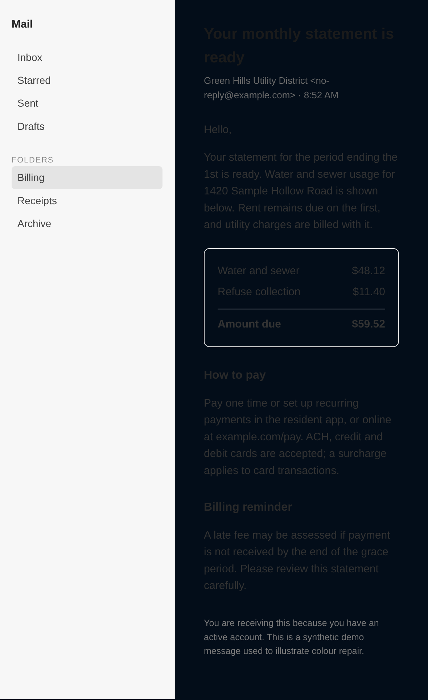
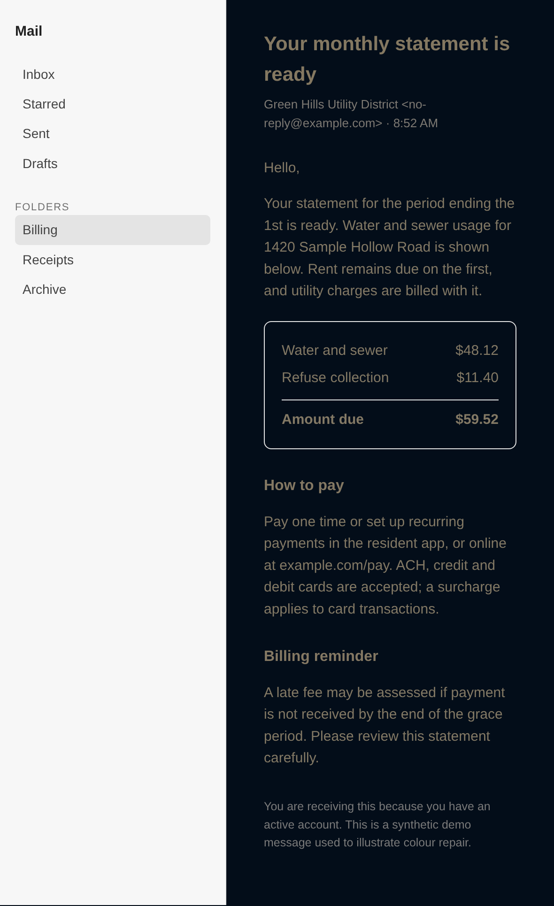

# Omarchy Themify

A Manifest V3 browser extension that makes web pages follow the **current
Omarchy desktop theme** — and keeps following it live as you switch themes.

- **No network. No tracking. Readable source.** The only non-page state it
  touches is your own theme palette, read by a local native host running as you.
- **Reads the real palette**, not a guess: a native messaging host reads
  `~/.local/state/omarchy/current/theme/colors.toml`.
- **Flips apps' own dark mode.** Most web apps gate their theme on
  `prefers-color-scheme`, which a normal content script cannot change. This one
  overrides it in the page's own JS context, so the app *becomes* dark instead of
  being painted over.
- **Repairs text the theme makes unreadable.** Sites (and nearly every HTML
  email) hardcode dark ink for an assumed white canvas. Once the page is dark,
  that text silently disappears. A second pass finds those runs and nudges just
  the text colour until it is readable — see
  [Contrast repair](#contrast-repair-text-the-theme-makes-unreadable).

## How it works

```
omarchy-theme-set ──hook──► hooks/themify-theme-set  (SIGUSR1)
                                      │
                                      ▼
┌──────────────┐  length-prefixed JSON  ┌────────────────────┐
│ native host  │ ─────────────────────► │ browser service    │
│ (python)     │  push on change + ping │ worker (MV3 bg)    │
└──────────────┘                        └─────────┬──────────┘
  reads ~/.local/state/omarchy/current/           │ chrome.tabs.sendMessage
    theme.name, theme/colors.toml                 ▼
                                      ┌────────────────────────────┐
                                      │ content scripts            │
                                      │ • derive surfaces (WCAG)   │
                                      │ • inject themed CSS        │
                                      │ • advertise --om-* vars    │
                                      │ • repair unreadable text   │
                                      └─────────┬──────────────────┘
                                                │ postMessage / attr
                                                ▼
                                      ┌────────────────────────────┐
                                      │ inject-prefers-color-      │
                                      │ scheme.js  (MAIN world)    │
                                      │ overrides matchMedia()     │
                                      └────────────────────────────┘
```

**Two ways the host learns the theme changed:** omarchy's own `theme-set` hook
signals it with `SIGUSR1` (instant, zero cost between changes), with a slow
mtime poll as a fallback if the hook isn't installed.

**Polarity is derived from WCAG relative luminance of the background**, not the
theme's `mode` field. A theme named "day" that ships a dark palette is still
treated as dark — and several stock themes don't declare a mode at all.

## Install

```bash
./install.sh              # host manifests + theme-set hook
./install.sh --flags      # also add --load-extension (needs a browser restart)
./install.sh --uninstall  # reverse it
```

Then load the extension: `brave://extensions` → Developer mode → **Load
unpacked** → select this folder. The extension ID is pinned via `key`
(`doiheolmnhipkonmobdifpcloeehoknb`), so the host manifest's `allowed_origins`
matches no matter where the folder lives. Move the folder and re-run
`install.sh` (the host path is baked in absolute).

After editing any extension file, hit ⟳ on the extension card and refresh the
page. No uninstall/reinstall needed.

### Key material stays OUT of this folder

Only the **public** half of the ID keypair belongs in the repo, as the
`key` field in `manifest.json`. The private half lives in
`~/.config/omarchy-themify/keys/key.pem` (0600), never here — Chromium warns if
it finds a `*.pem` inside a folder loaded unpacked, and the private key is a
secret that can impersonate the extension.

The extension ID derives from the `key` in the manifest, **not** from any file
in this folder, so moving the private key out does not change the ID and does
not require reinstalling the host manifests. To regenerate a keypair (which
*does* change the ID), run `native/gen-key.sh` — it writes outside the folder
and refuses to clobber an existing key.

## Contrast repair: text the theme makes unreadable

The generic rules repaint the page, but they cannot see a site's own hardcoded
colours. A great many pages — and effectively all HTML email — set ink like
`color: #333333` on a transparent background, assuming a white canvas. Paint that
canvas dark and the text is still there, just invisible. The colours are often
inline or in a class the theme cannot retint, so a stylesheet alone cannot fix it.

After the theme is applied, `omarchy-contrast.js` walks the text-bearing elements
and, for each one, works out the colour **actually rendered behind the glyphs**:
it climbs the ancestor chain compositing every background (alpha included, through
open shadow roots) until it hits an opaque colour. Then:

- contrast is checked against WCAG 2.1 AA — **4.5:1** for body text, **3:1** for
  large text (≥24px, or ≥18.66px bold). Translucent ink below ~90% opacity is
  treated as deliberate "dim" text and held to 4:1 instead.
- if it fails, the element's own `color` is nudged — **mixed toward a readable
  pole, not replaced**, so the hue and the design's intent survive, and the move
  is the *smallest* one that clears the bar (bisection). The first pole tried is
  the theme's own text colour, so repairs take on the theme's cast; a pure
  white/black pole is the fallback when the theme's colour cannot get there.
- everything it changes is recorded in a `WeakMap` and marked
  `data-om-themify-contrast="fixed"`, so it is reverted exactly when you turn
  repair off, turn the theme off, or switch themes.

**What it refuses to touch** (because it cannot judge, or must not):

| Case | Why |
|------|-----|
| text over a photo, gradient, blend mode or filter | the real backdrop is unknown |
| `background-clip: text` / `-webkit-text-fill-color` headings | the glyphs are painted by a gradient, not `color` |
| screen-reader-only text (clipped to 1px), `aria-hidden="true"` | not meant to be seen |
| colour with alpha < 0.55 | deliberately invisible / decorative |
| anything inside `[data-om-themify-skip]` | your explicit opt-out |
| text currently offscreen | judged when it scrolls in (keeps big pages cheap) |

Unreadable text you *want* left alone? Add `data-om-themify-skip` to that element
(or any ancestor). To change the thresholds, edit the tunables at the top of
`omarchy-contrast.js`. Toggle the whole pass from the popup — **Repair unreadable
text** — which also reports how many runs it repaired on the page you are on.

Cost is bounded: work is limited to a band around the viewport, ≤2500 elements per
pass, results are cached per element, and new DOM is handled by a `MutationObserver`.

The same message body before and after the pass (dark theme, hardcoded `#333` ink):




Both images are captured from a **synthetic** message (invented sender, address and
figures) by `node docs/capture-screenshots.js`, which drives the real content
scripts through headless Chromium — same harness as the E2E test. Nothing from a
real mailbox is involved, and the pair can be regenerated at any time. The script
refuses to write the "before" image unless the page's own `#333` ink really is
still in place at that moment, so the failure it shows cannot be faked by a stale
palette.

## Theme-following contract

Every theme injects these custom properties on `:root`, so per-site stylesheets
can use the live palette:

```
--om-polarity        dark | light (derived from luminance)
--om-bg              page background        --om-fg         body text
--om-bg-deep         deeper canvas          --om-fg-bright  headings/emphasis
--om-bg-sunken       recessed surface       --om-fg-dim     secondary text
--om-bg-raise        raised surface         --om-accent     links/emphasis
--om-bg-raise-2      2nd elevation          --om-accent-on  text on accent
--om-border          subtle border          --om-selection  ::selection bg
--om-border-strong   strong border          --om-muted      muted
--om-red --om-green --om-yellow --om-blue --om-magenta --om-cyan --om-orange --om-brown
```

The generic rules reference these variables rather than literal colors, so a
per-site stylesheet can retint a subtree by redefining them.

## Adding a per-site style

Generic tinting is safe but generic. For a site you care about, add a pack to
`omarchy-sites.js` — one key per hostname (`www.` stripped), a CSS string or
`(surfaces, vars) => css`:

```js
const SITES = {
  "example.com": `
    body { background: var(--om-bg) !important; }
    .tile { background: var(--om-bg-raise); border-color: var(--om-border); }
  `,
};
```

Because packs reference `--om-*`, they keep following every theme with no edits.

**Prefer retinting the site's own design tokens over hand-writing selectors.**
If the site is Tailwind-based and publishes semantic tokens, overriding those
recolors the whole app at once and survives redesigns far better than targeting
class names. To find a site's tokens, open it in a browser and read the real
cascade — the tokens a site actually uses are often not obvious from the DOM.
`window.getComputedStyle(document.documentElement).getPropertyValue('--token')`
gets values; Chrome DevTools Protocol `CSS.getMatchedStylesForNode` shows which
token drives a given element (that is how the Rumble pack was built).

### Shipped packs

- **rumble.com** — retints Rumble's token layer: `--color-bg-default` (page +
  header), `--color-txt-default` (body text), `--bone` (header/nav text),
  `--background-highlight` (card surfaces), `--surface`, and `--brand-500`
  (accent). Rumble's own theme setting follows `prefers-color-scheme` on
  "System Default", so the MAIN-world shim already flips it to dark; the pack
  then makes it the *desktop's* dark rather than Rumble's, and applies in either
  Rumble theme.
- **x.com** — retints the x-web token system. X uses **two** token layers: the
  `--color-*` set for components and a separate legacy `--background` /
  `--foreground` pair that paints the page canvas (with `html` itself holding a
  literal black/white), so both must be overridden or the background stays
  stock. Neutral ramp (`--color-gray-*`) is rebuilt from the theme's bg→fg sweep
  to kill X's cool blue-grey; `--color-blue-*` (the accent: "For you" underline,
  links, verified badges) is rebuilt from the theme accent; `--color-magenta-*`
  (the like heart) and `--color-red-*` from the theme red.

### Tokens may be HSL triples

Some sites (X) define tokens as **HSL component triples** —
`--color-text: 200 7% 91%` — consumed as `hsl(var(--tok))`. Overriding those
with a hex value produces invalid CSS and the override **silently does nothing**.
Use `OmarchyColors.hslTriple(hex)` to emit the right form. A test asserts packs
contain no raw hex so this cannot regress quietly.

## Frames

Both script groups run in **every frame** (`all_frames: true`, plus
`match_about_blank: true` for same-origin blank frames), so apps that render
their UI inside iframes are themed too, and each frame's `matchMedia` reports the
desktop polarity.

## Tests

```bash
node test-manifest.js                 # wiring: all_frames, MAIN world, load order, files exist
node test-surfaces.js                 # color helpers + surface ladder (incl. mislabeled themes)
node test-polyfill.js                 # prefers-color-scheme override
node test-content.js                  # palette -> CSS, scheme publishing, site packs, idempotency
node test-contrast.js                 # contrast repair maths: parsing, compositing, minimal moves
node test-contrast-e2e.js             # real Chromium: repair on a hostile fixture page
xvfb-run -a node test-live-extension.js --headed   # the real extension + native host + live theme
/usr/bin/python3 test-host.py         # host + hook: SIGUSR1 push, ping, pidfile lifecycle
```

CI ([.github/workflows/test.yml](.github/workflows/test.yml)) runs the five
browser-free suites above on every push — the browser, native-host and live
suites need a real machine with Omarchy on it, so they stay local.

`test-host.py` temporarily rewrites `colors.toml` and restores it in a `finally`,
and runs under a private `XDG_RUNTIME_DIR` so it never touches a live browser's
pidfiles.

`test-contrast-e2e.js` launches a throwaway headless Chromium, injects the real
content scripts at the earliest possible moment (before `<html>` exists — the
`document_start` edge case) into `fixtures/contrast.html`, and asserts on computed
styles using an **independent** WCAG implementation, so a bug in the module's own
helpers cannot hide behind them. It covers the reported failure, inherited ink,
translucent panels, the skip list, late-arriving DOM, the offscreen band, revert
on disable, and re-enable idempotency.

`test-live-extension.js` is the only test that exercises the shipping path end to
end: the unpacked extension, the native host handshake, the palette broadcast, and
the repair pass against your *actual* current theme. It must run **headed** (under
`xvfb-run` or a real display) — Chromium's headless mode does not support native
messaging, so a headless run would silently look like a broken extension. It SKIPs
cleanly if the host manifest isn't installed.

## Files

| File | Purpose |
|------|---------|
| `manifest.json` | MV3 manifest; pins ID; MAIN-world + isolated scripts, all frames |
| `background.js` | native port, palette cache, fan-out to tabs |
| `omarchy-colors.js` | WCAG luminance/contrast, mixing |
| `omarchy-surfaces.js` | palette → surface ladder + polarity |
| `omarchy-sites.js` | per-site packs (token overrides keyed by hostname) |
| `omarchy-contrast.js` | finds text the theme made unreadable and repairs it (WCAG, revertible) |
| `content.js` | injects CSS, publishes scheme, merges the site pack, drives the repair pass |
| `inject-prefers-color-scheme.js` | MAIN-world `matchMedia` override |
| `popup.html` / `popup.js` | enable + repair toggles, palette swatches, per-page repair count |
| `fixtures/contrast.html` | hostile fixture page for the contrast E2E |
| `native/themify-host.py` | reads + watches the palette, pushes on change |
| `native/gen-key.sh` | regenerate the ID keypair (outside the extension folder) |
| `native/com.omarchy.themify.json.template` | host manifest template rendered by `install.sh` |
| `hooks/themify-theme-set` | theme-set hook → SIGUSR1 |
| `docs/capture-screenshots.js` | regenerates the two README screenshots from a synthetic message |
| `install.sh` | wiring + `--uninstall` |

## Notes / gotchas

- Themes differ in shape. Canonical Omarchy themes use named colors (`red`,
  `green`, …); some retro themes ship only `color0`–`color15` and **no**
  `colors.toml` at all — omarchy generates it from `alacritty.toml`. Both forms
  are handled.
- A few stock themes have no `mode` key; polarity falls back to luminance.
- Browser chrome color is a separate mechanism (omarchy's own
  `BrowserThemeColor` policy) and already follows the theme.
- A pack's token coverage is never total: some regions use literal values or a
  palette ramp the pack does not remap (e.g. borders may stay the site's own
  grey). Extend the pack if a specific region looks off.
- Text sitting on a photo or gradient is deliberately left alone by the repair
  pass — there is no backdrop to judge. If a site's hero text is unreadable, that
  needs a per-site pack, not the generic pass.
- The repair pass only ever writes `color` (with `!important`), never layout,
  size or background, so it cannot reflow a page. Every write is reverted exactly
  when repair or the theme is turned off.

MIT.
